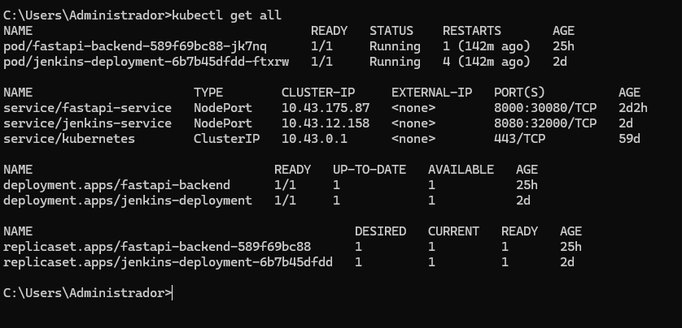

# FastAPI + Jenkins + Kubernetes 

 

Projeto para aprendizado com construção e deploy de uma aplicação (backend + frontend) com deploy no Kubernetes e automação CI/CD utilizando o Jenkins. 

 

## Stack utilizada 

 

**Back-end:** Python, FastAPI 

 

**CI/CD:** Jenkins, Ngrok 

 

**Deploy:** Kubernetes 

 

## Rodando localmente o backend no Docker + publicação no Dockerhub 

 

Faça o build da imagem (esteja no diretório backend) 

 

```bash 

  docker build --no-cache -t fastapi-backend . 

``` 

 

Execute o container (verifique as portas) 

 

```bash 

  docker run -d -p 127.0.0.1:8000:8000 --name fastapi-backend fastapi-backend 

``` 

 

Renomeie sua imagem para o padrão do Dockerhub (coloque o seu usuário) 

 

```bash 

  docker tag fastapi-backend SEU_USUARIO_DOCKERHUB/fastapi-backend:1 

``` 

 

Publique o container no Dockerhub (esteja logado) (coloque o seu usuário) 

 

```bash 

  docker push SEU_USUARIO_DOCKERHUB/fastapi-backend:1 

``` 

 

## Deploy do backend no kubernetes 

 

arquivo deployment.yaml 

 

```yaml 

  apiVersion: apps/v1 

  kind: Deployment 

  metadata: 

    name: fastapi-backend 

    labels: 

      app: fastapi-backend 

  spec: 

    replicas: 1 

    selector: 

      matchLabels: 

        app: fastapi-backend 

    template: 

      metadata: 

        labels: 

          app: fastapi-backend 

      spec: 

        containers: 

        - name: fastapi-backend 

          image: pedromarineli/fastapi-backend:1 

          ports: 

          - containerPort: 8000 

``` 

 

arquivo service.yaml  

 

```yaml 

  apiVersion: v1 

  kind: Service 

  metadata: 

    name: fastapi-service 

  spec: 

    type: NodePort 

    selector: 

      app: fastapi-backend 

    ports: 

      - protocol: TCP 

        port: 8000 

        targetPort: 8000 

        nodePort: 30080 

``` 

 

Aplique o deployment 

 

```bash 

  kubectl apply -f backend/deployment.yaml 

``` 

 

Aplique o service 

 

```bash 

  kubectl apply -f backend/service.yaml 

``` 

 

## Deploy do jenkins no kubernetes 

 

- (Arquivos Dockerfile e .yaml estarao no diretorio /jenkins) 

- Faca build e push da imagem do jenkins no Dockerhub  

- crie um diretorio `/data/jenkins-volume` no seu cluster (para o volume persistente) 

 

Aplique o arquivos .yaml 

 

```bash 

  kubectl apply -f jenkins/jenkins-pv.yaml 

  kubectl apply -f jenkins/jenkins-pvc.yaml 

  kubectl apply -f jenkins/jenkins-deploy.yaml 

  kubectl apply -f jenkins/jenkins-np.yaml 

``` 

 

Para pegar a chave secreta do jenkins: 

 

```bash 

  kubectl exec -it <nome-do-pod-jenkins> -- cat /var/jenkins_home/secrets/initialAdminPassword 

``` 

 

No jenkins, instale os seguintes plugins: 

 

- Docker 

- Docker Pipeline 

- Kubernetes CLI 

 

 

## Deploy automático com o jenkins + webhook  

 

- Crie as credenciais do dockerhub (usuario e senha) e kubernetes (secret file, que é o arquivo kubeconfig do seu cluster, porém apontando para o servidor `https://kubernetes.default.svc`) no jenkins 

 

 

Pipeline completa 

 

```groovy 

  pipeline { 

      agent any 

 

      stages { 

          stage('Build Docker Image') { 

              steps { 

                  script { 

                      dockerapp = docker.build("pedromarineli/fastapi-backend:${env.BUILD_ID}", '-f ./backend/Dockerfile ./backend') 

                  } 

              } 

          } 

 

          stage('Push Docker Image') { 

              steps { 

                  script { 

                      docker.withRegistry('https://registry.hub.docker.com', 'dockerhub-cred') { 

                          dockerapp.push('latest') 

                          dockerapp.push("${env.BUILD_ID}") 

                      } 

                  } 

              } 

          }    

 

          stage('Deploy no Kubernetes') { 

              environment { 

                  tag_version = "${env.BUILD_ID}" 

              } 

              steps { 

                  withKubeConfig([credentialsId: 'kubernetes-cred']) { 

                      sh 'sed -i "s/{{tag}}/$tag_version/g" ./backend/deployment.yaml' 

                      sh 'kubectl apply -f backend/deployment.yaml' 

                  } 

              } 

          }    

      } 

  } 

``` 

 

- Ative o trigger `GitHub hook trigger for GITScm polling` nas configurações da sua pipeline 

- Para expor nosso cluster publicamente, utilizaremos o ngrok (https://ngrok.com/) 

- Faca o download para o seu SO, e crie uma conta gratuita 

 

Ao executar o ngrok autentique com o token disponível na dashboard após o login e exponha o cluster (ngrok retornara uma url) 

 

```bash 

  ngrok config add-authtoken <token> 

``` 

```bash 

  ngrok http http://localhost:32000 

``` 

 

- No github, vá para as configurações do seu repositório (que deve ser o mesmo utilizado pela pipeline, inclusive a mesma branch) e crie um webhook apontando para a  url do ngrok: `<urldongrok>/github-webhook/`, o content type deve ser `application/json` 

- De um push no repositório e veja se a pipeline ativa automaticamente 

 

 

## Screenshots 

 

Jenkins 

 

 

 

 

ngrok + github 

 

 

 

 

Kubernetes 

 

 

 